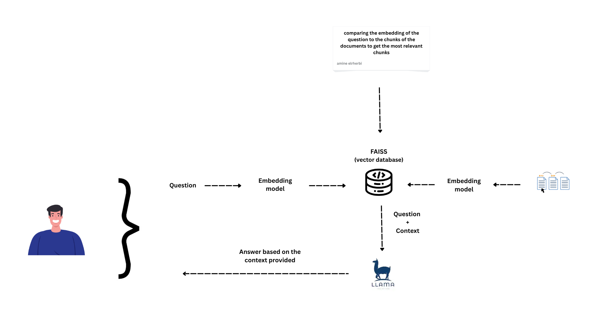

# 🧠 Tuberculosis RAG Chatbot (PDF QA using FAISS + Groq LLaMA3)

A medical chatbot that answers questions about tuberculosis by reading official PDF documents using a **Retrieval-Augmented Generation (RAG)** pipeline built with **FAISS**, **Sentence Transformers**, and **Groq-hosted LLaMA 3**.

This project helps **students, patients, and healthcare professionals** get clear, reliable answers based on up-to-date resources from the **World Health Organization** and **International Standards for Tuberculosis Care** and **CDC**.

---

## 🖼️ Project Architecture

  

---

## 📽️ Demo Video

[ Click here to watch the demo](https://drive.google.com/drive/folders/1rhmyh866TvEqPsQ-Nae_JNyVMKRwMGCb?usp=sharing)  

---

## 💡 Key Features

- 🔍 **Semantic search over PDFs** using Sentence Transformers + FAISS
- 🧠 **Natural language answers** generated with **LLaMA 3 via Groq API**
- 📄 **Persistent vector database**: only new PDFs are re-embedded
- 🏥 **Medical-focused prompt** for simple, accurate responses
- 🔁 **Interactive web chat UI** powered by Flask + HTML/JS
- 📚 Built using **real WHO and global health documents**

---

## 📦 Tech Stack

| Component         | Technology                              |
|------------------|------------------------------------------|
| Embedding Model  | `BAAI/bge-base-en-v1.5` (SentenceTransformers) |
| Vector Store     | FAISS                                    |
| Language Model   | LLaMA 3 (via [Groq API](https://console.groq.com)) |
| Backend Server   | Python + Flask                           |
| PDF Processing   | `pdfplumber`                             |
| Frontend         | HTML + JavaScript + CSS (Flask-served)         |

---

## 🚀 Getting Started

### 1. Clone the repository

```bash
git clone https://github.com/your-username/tuberculosis-rag-chatbot
cd tuberculosis-rag-chatbot
```
2. Create a virtual environment and install dependencies
```
python -m venv venv
venv\Scripts\activate     # on Windows
# or
source venv/bin/activate  # on Linux/macOS

pip install -r requirements.txt
Make sure requirements.txt includes:

flask
flask_cors
numpy
pdfplumber
sentence-transformers
langchain
openai
```
3. Add your PDF files  
Place your tuberculosis PDFs inside this folder:   
./RAG/tuberculous  
Already used:  

3 WHO Tuberculosis Guidelines PDFs

1 International Standards for Tuberculosis Care PDF

3 CDC

4. Set your Groq API key
Create a .env file (or set as environment variable):

GROQ_API_KEY=your_api_key_here
Or set it directly in your terminal:

set GROQ_API_KEY=your_api_key_here  # on Windows
# or
export GROQ_API_KEY=your_api_key_here  # on Linux/macOS
You can get your API key from Groq Console

5. Run the Flask application
python main.py
Then visit http://127.0.0.1:5000 to chat with your medical assistant.

📁 Project Structure
tuberculosis-rag-chatbot/
│
├── main.py                  # Main backend logic (Flask + RAG)
├── templates/
│   └── index.html           # Web UI (served by Flask)
├── vectorstore/             # FAISS index files (index.faiss, index.pkl)
├── pdf_index.json           # Tracks already-embedded PDFs
├── tuberculous/             # Folder containing tuberculosis PDFs
├── assets/
│   └── architecture.png     # Diagram placeholder
└── requirements.txt         # Dependencies list
💬 Example Questions You Can Ask
What are the symptoms of tuberculosis?

How is tuberculosis transmitted?

What are the recommended treatments according to WHO?

What is DOTS strategy?

🎯 Benefits & Use Cases
✅ Reliable answers from real medical documentation

✅ Helps students revise or learn about tuberculosis

✅ Aids patients in understanding their condition

✅ Demonstrates practical use of RAG in healthcare

✅ Reusable for any medical topic with just new PDFs

🛡️ Disclaimers
This chatbot is for educational and demonstration purposes only. It is not a substitute for professional medical advice. Always consult a qualified health provider with any questions about a medical condition.

🧠 Future Improvements
 Add multilingual support (e.g., French, Arabic)

 Improve frontend with React or Streamlit

 Support multiple medical domains via document categorization

 Add user chat history and context memory

⭐️ Show your support
If you like this project, please give it a ⭐️ on GitHub and share it with your network!

🧑‍💻 Author
Mohamed Amine El Rherbi
Information Systems & Big Data Engineering


---
